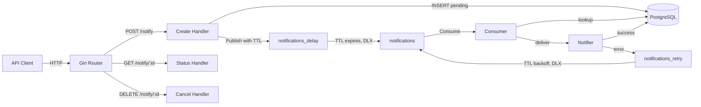

# Gong

[](https://go.dev/)
[](https://github.com/venexene/gong/actions)
[](https://www.docker.com/)
[](LICENSE)

Delayed notification service. Accepts notifications via REST API, persists them in PostgreSQL, and delivers at the scheduled time using RabbitMQ TTL + dead-letter exchange. Failed deliveries are retried with exponential backoff. Built with Go.

## Tech Stack

**Go** · **Gin** · **PostgreSQL** · **RabbitMQ** · **Docker** · **GitHub Actions**

## Architecture



**Flow:** `POST /notify` → DB (pending) → delay queue with TTL → main queue → consumer → deliver or retry with backoff.

**Retry strategy:** `5s × 2^(retry−1)`, capped at 10 minutes, max 10 attempts. Exhausted retries are marked as `failed`.

## Quick start

```bash
cp .env.example .env
docker compose up -d --build
```

Open `http://localhost:8080/test_server` - should return `Hello! Server is running.`.

## API

### Endpoints

```
POST   /notify          schedule a delayed notification
GET    /notify/:id      check notification status
DELETE /notify/:id      cancel a pending notification
GET    /test_server     health check
```

## Configuration

All settings in `.env`. Copy `.env.example` and fill in your values.

| Variable | Default | Purpose |
|----------|---------|---------|
| `HTTP_PORT` | `8080` | listen port |
| `DB_HOST` | - | PostgreSQL host (required) |
| `DB_PORT` | - | PostgreSQL port (required) |
| `DB_USER` | - | PostgreSQL user (required) |
| `DB_PASSWORD` | - | PostgreSQL password (required) |
| `DB_NAME` | - | database name (required) |
| `RABBIT_HOST` | - | RabbitMQ host (required) |
| `RABBIT_PORT` | - | RabbitMQ port (required) |
| `RABBIT_USER` | - | RabbitMQ user (required) |
| `RABBIT_PASSWORD` | - | RabbitMQ password (required) |

## Docker Compose

| Service | Role |
|---------|------|
| `postgres` | PostgreSQL 18 with `pg_isready` healthcheck |
| `rabbitmq` | RabbitMQ 3 with management UI on `:15672` |
| `app` | Go binary, waits for healthy postgres and rabbitmq |

All services on the `notifications-network` bridge. App healthcheck via `curl /test_server`. Volumes `pg_data` and `rabbitmq_data` persist across restarts. App restarts `unless-stopped`.

## Structure

```
cmd/
  main.go                  entry point, calls app.Run()
internal/
  app/                     dependency injection, router setup, graceful shutdown
  config/                  .env loader with validation and defaults
  handler/                 HTTP handlers (Gin)
  queue/                   RabbitMQ queues, publisher, consumer, retry logic
  repository/              PostgreSQL store via pgxpool, Store interface
init.sql                   database schema
```

## Testing

```bash
make test                         # unit + integration tests with race detector
make lint                         # golangci-lint (revive, staticcheck, gocritic, errcheck)
```

- **Handlers**: table-driven unit tests with mocked `repository.Store` and `queue.Publisher` via `httptest`
- **Queue**: unit tests for `calcRetryDelay` across all boundary values, `Notifier` interface contract
- **Config**: validation of all required variables, default values, DSN and RabbitMQ URL format
- **Repository**: integration tests with `testcontainers-go` (PostgreSQL 18 Alpine) - each test gets a fresh container, covering all CRUD operations and state transitions

## CI/CD

GitHub Actions on every push and pull request:

| Job | What it does |
|-----|--------------|
| `lint` | `golangci-lint run --timeout 5m` |
| `test` | `go mod tidy -diff`, `go build`, `go vet`, `go test -race` |
| `build` | `docker build .` |

## Development

```bash
make up          # build and start all services
make down        # stop containers
make clean-db    # stop containers and remove database volumes
make run         # run the server locally (requires PostgreSQL + RabbitMQ)
make test        # run tests with race detection
make lint        # run golangci-lint
make build       # build binary to ./gong
make clean       # remove built binary
```
